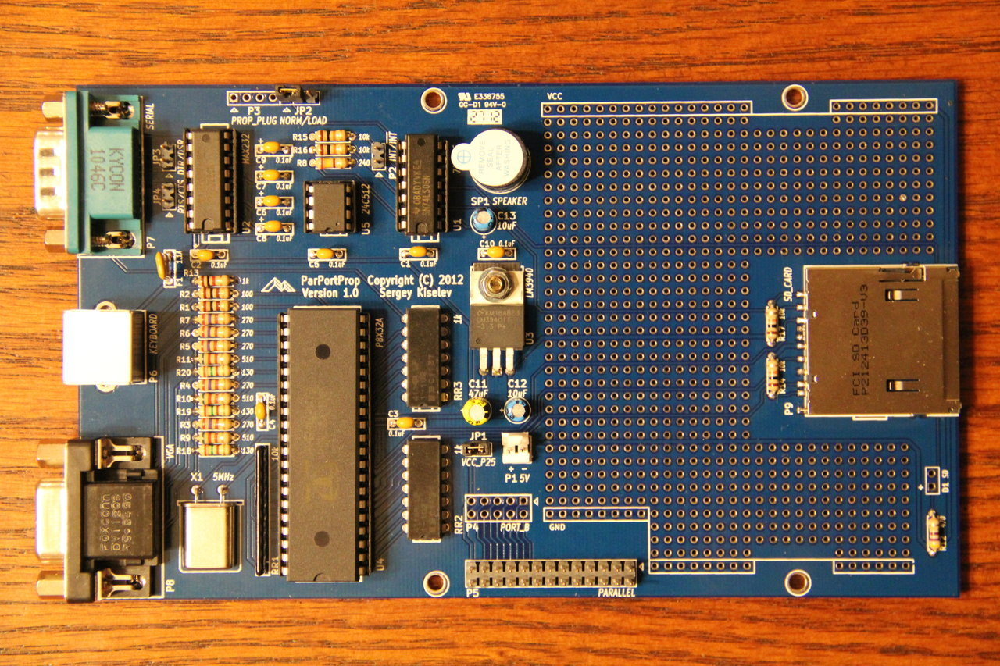

# ParPortProp
VGA, PS/2 keyboard, SD card interface, and speaker extension board for Zeta SBC

## Overview

The ParPortProp (Parallel Port Propeller) board allows extending Zeta and N8VEM SBCs with VGA, PS/2 keyboard, SD card interfaces and a speaker. It is based on Parallax Propeller microcontroller. The ParPortProp design is similar to PropIO and PockeTerm, but it interfaces to a 8255 PPI based parallel port.

## Specifications

ParPortProp provides following capabilities:
* VGA output with 64 colors support
* PS/2 compatible keyboard interface
* SD card interface
* RS 232 serial port (3 wires - RX, TX, and GND signals only). Serial port can be used for programming the Propeller firmware in on-board EEPROM.
* Speaker
* PropPlug header
* Interrupt header (allows interrupt driven I/O)
* Port B header (can be used for GPIO).
* Prototype area

## Hardware Documentation

### Schematic and PCB Layout
* [Schematic - Version 1.1](KiCad/ParPortProp-Schematic-1.1.pdf) (current version)
* [Schematic - Version 1.0](KiCad/ParPortProp-Schematic-1.0.pdf)
* [Schematic - Version 0.9](KiCad/ParPortProp-Schematic-0.9.pdf) (prototype)
* [PCB Layout - Version 1.1](KiCad/ParPortProp-Board-1.1.pdf) (current version)
* [PCB Layout - Version 1.0](KiCad/ParPortProp-Board-1.0.pdf)
* [PCB Layout - Version 0.9](KiCad/ParPortProp-Board-0.9.pdf) (prototype)

### Jumpers and Connectors

#### Jumper JP1 - VCC_P25
Jumper JP1 connects pin 25 of the parallel port P5 to the ParPortProp Vcc (+5V). Install this jumper if your SBC is configured to provide Vcc on that pin.

Jumper Position     | Description
--------------------|------------
**installed (default)** | ParPortProp is configured to receive Vcc from pin 25 of the parallel port P5
not installed       | Use P1 connector to provide Vcc to the ParPortProp

**WARNING: Make sure to disconnect this jumper when providing power using P1 connector.**

#### Jumper JP2 - NORM/LOAD
Jumper JP2 selects between normal operation mode and EEPROM programming mode.

Jumper Position     | Description
--------------------|------------
**1-2 (default)**       | Normal operation mode. Propeller RESn pin is controlled by PPI port PC2
2-3                 | RS-232 programming mode. Propeller RESn pin is controlled by serial's port DSR line.
not installed       | PropPlug programming mode. Propeller RESn pin is controlled by PropPlug.

#### Jumper JP3 - DTR/DSR
Jumper JP3 connects DTR signal of the serial port to DSR signal. It might be useful for terminals that expect to have hardware flow control.

Jumper Position     | Description
--------------------|------------
**installed (default)** | DTR is connected to DSR
not installed       | DTR and DSR are not connected

#### Jumper JP4 - RTS/CTS
Jumper JP4 connects RTS signal of the serial port to CTS signal. It might be useful for terminals that expect to have hardware flow control.

Jumper Position     | Description
--------------------|------------
**installed (default)** | RTS is connected to CTS
not installed       | RTS and CTS are not connected

#### Connector P1 - Power
P1 can be used as an alternative power source for ParPortProp (instead of the parallel port pin 25).

Pin | Description
----|------------
1   | 5V
2   | GND

#### Connector P2 - Interrupt
P2 pins are connected to the PPI pin PC3 and can be used for interrupt driven I/O, by generating interrupts on output buffer empty and input buffer full events.

Pin | Description
----|------------
1   | Interrupt output (TTL, active high)
2   | Interrupt output (open collector, active low)

#### Connector P3 - PropPlug
Connector P3 can be used for connecting PropPlug - a USB to a TTL-level RS232 converter intended for Propeller's EEPROM in-circuit programming.

Pin | Description
----|------------
1   | GND
2   | RESn (Propeller reset input)
3   | TX
4   | RX

#### Connector P4 - Port_B

Pin | Description | Pin | Description | Pin | Description | Pin | Description | Pin | Description
----|-------------|-----|-------------|-----|-------------|-----|-------------|-----|------------
1   | PB7         | 3   | PB6         | 5   | PB5         | 7   | PB4         | 9   | PAR_VCC (pin 25 of P5)
2   | PB0         | 4   | PB1         | 6   | PB2         | 8   | PB3         | 10  | GND

#### Connector P5 - Parallel
Connector P5 connects ParPortProp to the SBC's PPI interface.

Pin | Description | Pin | Description | Pin | Description | Pin | Description
----|-------------|-----|-------------|-----|-------------|-----|------------
1   | PC0         | 9   | PC4         | 17  | PB7         | 25  | PAR_VCC on NC
2   | PA0         | 10  | PA4         | 18  | PB0         | 26  | GND
3   | PC1         | 11  | PC5         | 19  | PB6		      |     |
4   | PA1         | 12  | PA5         | 20  | PB1		      |     |
5	  | PC2         | 13  | PC6         | 21  | PB5		      |     |
6   | PA2         | 14  | PA6         | 22  | PB2		      |     |
7   | PC3         | 15  | PC7         | 23  | PB4		      |     |
8   | PA3         | 16  | PA7         | 24  | PB3		      |     |

#### Connector P6 - Keyboard
P6 is a PS/2 compatible keyboard port

Pin | Description
----|------------
1   | Keyboard Data
2   | Not connected
3   | GND
4   | 5V
5   | Keyboard Clock
6   | Not connected

#### Connector P7 - Serial Port
P7 is the serial port connector. It can be used as the second serial port or for programming Propeller's EEPROM. P7 uses pinout similar to that of IBM AT serial port (with some signals missing). Use a null modem cable to connect to a PC.

Pin | Description
----|------------
1   | Not connected
2   | RX
3   | TX
4   | DTR - can be connected to DSR using jumper JP3
5   | GND
6   | DSR (in programming mode connected to Propeller's RESn)
7   | RTS - can be connected to CTS using jumper JP4
8   | CTS - can be connected to RTS using jumper JP4
9   | Not connected
shield | GND

#### Connector P8 - VGA

Pin | Description | Pin | Description | Pin | Description
----|-------------|-----|-------------|-----|------------
1   | Red         | 6   | GND         | 11  | Not connected
2   | Green       | 7   | GND         | 12  | Not connected
3   | Blue        | 8   | GND         | 13  | Horizontal Synchronization
4   | Not connected | 9 | 5V          | 14  | Vertical Synchronization
5   | GND         | 10  | GND         | 15  | Not connected

#### Connector P9 - SD_Card
P9 provides SPI (1-bit) interface to SD card.

Pin | Description | Pin | Description | Pin | Description
----|-------------|-----|-------------|-----|------------
1   | /nCS1 (Card select) | 4 | Vdd (3.3V) | 7 | DO (Data Output)
2   | DI (Data Input) | 5 | CLK       | 8  | nIRQ (not used, pull up)
3   | GND         | 6   | GND         | 9  | DAT2 (not used, pull up)

### Bill of Materials (BOM)

Component Type | Reference | Description                                    | Quantity | Possible sources and notes
---------------|-----------|------------------------------------------------|----------|---------------------------
PCB            |           | ParPortProp Version 1.1 PCB                    | 1        | Retrobrew Computer Board inventory, order from a PCB manufacturer of your choice using provided Gerber files
Capacitor      | C1 - C10  | 0.1 uF ceramic, 5.08 mm lead spacing           | 10       | Mouser 80-C323C104K5R; Jameco 25523
Capacitor      | C11       | 47 uF, 6.3V electrolytic                       | 1        | Mouser 667-ECA-1HHG470
Capacitor      | C12       | 220 uF, 6.3V electrolytic                      | 1        | Note: C12 is marked as 10 uF on the PCB. For better stability and video quality please use 220uF instead.
Capacitor      | C13       | 10 uF, 16V electrolytic                        | 1        | Mouser 667-ECA-1HHG100B
Diode          | D1        | 3 mm LED indicator lamp                        | 1        | Mouser 696-SSF-LXH103LID, 696-SSL-LX3044IT
Fuse           | F1        | 1.1A resettable fuse                           | 1        | Mouser 576-16R110BPR
Connector      | JP1, JP3, JP4, P2 | 2×1 pin header                         | 4        | Jameco 108338; Mouser 649-68002-102HLF
Connector      | P1        | 2 pin header with friction lock                | 1        | Optional; required if using P1 for providing power to the ParPortProp board. Jameco 232266, 613931; Mouser 571-6404562, 571-3-641126-2, 571-3-641215-2 Corresponding female connector: Jameco 234798; Mouser 571-770602-2; Contacts (2 contacts needed): Jameco 234923, 736501; Mouser 571-770666-1 It is recommended to use a polarized header to avoid incorrect power polarity.
Connector      | JP2, P3   | 7×1 pin header                                 | 1        | Mouser 649-68016-207HLF (right angle) Note: Right angle header can be used for better accessibility of the PropPlug on an installed board.
Connector      | P4        | 5×2 pin header                                 | 1        | Optional; required if using PPI Port B. Mouser 649-68602-110HLF
Connector      | P5        | 13×2 pin header                                | 1        | Jameco 53495; Mouser 649-68602-126HLF, 649-77313-824-26LF
Connector      | P6        | 6 pin Mini-DIN connector                       | 1        | Mouser 806-KMDGX-6S-BS2715C, Jameco 119475
Connector      | P7        | DE9M, right angle PCB mount                    | 1        | Jameco 104943, 614441, 614459, 614432; Mouser 806-K22X-E9P-N, 806-K22X-E9P-NJ15-99 (teal color), 571-1734351-1, 571-7478404
Connector      | P8        | DE15F, right angle PCB mount                   | 1        | Mouser 806-K66X-E15S-NJVESA (blue color), 806-K66X-E15S-NJ30
Connector      | P9        | SD card socket                                 | 1        | Mouser 649-10067847-001RLF, Digi-Key 101-00313-68-02CT-ND (Amphenol 101-00313-68-02), Atom SD01-AP-20330
Resistor       | R1, R2    | 100 Ohm, 1/4 W                                 | 2        | Mouser 291-100-RC
Resistor       | R3 - R7   | 270 Ohm, 1/4 W                                 | 5        | Mouser 291-270-RC
Resistor       | R8        | 240 Ohm, 1/4 W                                 | 1        | Mouser 291-240-RC
Resistor       | R9 - R11  | 510 Ohm 1/4 W                                  | 3        | Mouser 291-510-RC
Resistor       | R12       | 470 Ohm, 1/4 W                                 | 1        | Jameco 690785; Mouser 291-470-RC
Resistor       | R13       | 1 kOhm, 1/4 W                                  | 1        | Mouser 291-1K-RC
Resistor       | R14 - R17 | 10 kOhm, 1/4 W                                 | 4        | Jameco 691104; Mouser 291-10K-RC
Resistor       | R18 - R20 | 130 Ohm, 1/4 W                                 | 3        | Mouser 291-130-RC
Resistor Array | RR1       | 10 kOhm, 10 pin, bussed resistor array         | 1        | Mouser 266-10K-RC
Resistor Array | RR2, RR3  | 1 kOhm, 14 pin DIP, isolated resistor array    | 2        | Mouser 652-4114R-1LF-1K. Note: Can be replaced with 14 x 1 kOhm resistors
Speaker        | SP1       | 12 mm speaker                                  | 1        | Mouser 665-AT-1224TWTR
IC             | U1        | 74LS06                                         | 1        | Mouser 595-SN74LS06N; Unicorn Electronics; Jameco 46359
IC             | U2        | MAX232A                                        | 1        | Mouser 595-TRS202ECN, 701-SP202ECP-L, 700-MAX202CPE, 700-MAX232ACP; Jameco 875384, 1127599, 1800552
IC             | U3        | LM3940IT-3.3 3.3V low dropout voltage regulator | 1       | Mouser 926-LM3940IT-3.3NOPB; Jameco 192524, 840034
IC             | U4        | P8X32A Parallax Propeller, DIP40               | 1        | Mouser 619-P8X32A-D40; Jameco 2007134
IC             | U5        | 24LC512 serial EEPROM                          | 1        | Mouser 579-24LC512-I/P
IC Socket      | U1        | 14 pin 300 mil DIP socket                      | 1        | Jameco 37162; Mouser 517-4814-3000-CP, 649-DILB14P-223TLF
IC Socket      | U2        | 16 pin 300 mil DIP socket                      | 1        | Jameco 37373; Mouser 517-4816-3000-CP, 649-DILB16P-223TLF
IC Socket      | U4        | 40 pin 600 mil DIP socket                      | 1        | Jameco 41111; Mouser 517-4840-6000-CP, 649-DILB40P223TLF
IC Socket      | U5        | 8 pin 300 mil DIP socket                       | 1        | Jameco 51571; Mouser 517-4808-3000-CP, 649-DILB8P223TLF
Crystal        | X1        | 5 MHz crystal                                  | 1        | Mouser 520-HCA500-20X

Mattias Engström (engstrom at basslab.net) has created the following spreadsheet on 2016-May-11 for ordering BOM components from Mouser. It should be directly importable into their order system. ParPortProp_Mouser.xlsx

### ROM Programming
Operation of the ParPortProp requires appropriate firmware be programmed into the 24LC512 serial EEPROM (U5). This firmware controls the operation of the on-board Propeller processor which automatically loads the firmware at startup. Once the Propeller has loaded the firmware, it will initialize all peripherals and begin waiting for commands from the host Zeta.

Since the ParPortProp is purely a slave processor for a host Zeta, it is also necessary that the host Zeta be programmed with an appropriate ROM image that includes support for an attached ParPortProp.

Both the Zeta and ParPortProp ROM firmware images are included in v2.0 or greater RomWBW distributions. At this time, RomWBW v2.0 is a beta release and can be found in the RomWBW folder. The file is called “RomWBW2-Beta.zip”. Download this file onto your local machine and unzip it with any standard decompression tool. Once this is done, you can follow the instructions below to complete the programming of the Zeta and the ParPortProp.

#### Zeta ROM

Within the RomWBW distribution, you will find a directory called Output. This directory contains a large number of pre-built ROM images. You will need to program either the “zeta_ppp.rom” or the “zeta_ppp_z.rom” image into your Zeta ROM. Both of these have support for the ParPortProp. The “_z” version is based on the Z System OS and the other one is based on the CP/M 2.2 OS.

Initial programming the Zeta ROM is accomplished using an EPROM programmer suitable for your (E)EPROM chip. Selection and use of a programmer is beyond the scope of this document.

Reprogramming a Zeta ROM can be performed on a live, running system using David Giles in-situ programming application called FLASHZ. Documentation for this application is included in the Doc directory of the RomWBW distribution.

#### Propeller ROM
Within the RomWBW distribution, you will find a directory called Support. Within this directory is a directory called ParPortProp. This directory contains a pre-built ROM image for the ParPortProp. The file is called “ParPortProp.eeprom”.

Programming of the ParPortProp EEPROM can be accomplished in any of the following ways:
1. Via a standalone EEPROM programmer
2. Via a serial cable to the serial port on the ParPortProp
3. Via a PropPlug adapter available from Parallax

For #1, selection and use of a suitable programmer is required and beyond the scope of this document.

For #2 or #3, you must download the Propeller Tool from Parallax (free). This tool includes documentation on using either a serial cable or a PropPlug to program your device. In a nutshell, you will follow this procedure to program the ParPortProp.eeprom file:
1. Start the Propeller Tool
2. Use File → Open… to select and open ParPortProp.eeprom
3. Choose “Load EEPROM” from the subsequent “Object Info” dialog box.

### PCB Versions

* PCB Version 1.1 (Current version)
  * Increased prototype area pads' drill diameter to ~ 1 mm (40 mil)
  * Added two holes by the crystal for a mounting bracket
  * C12 reference switched with C13, changed C13 (3.3V rail filter capacitor) capacitance to 100 uF
  * Added C14 100 uF filter capacitor by SD card socket
* PCB Version 1.0
  * Fixed errata from the prototype
  * Changed board dimensions to match Zeta SBC dimensions
  * Improved VGA DAC design
  * Added resettable fuse for keyboard and VGA 5V
  * Added jumpers for RTS/CTS and DTR/DSR loopbacks
  * Added prototype area
  * Errata (to be fixed in the next PCB version):
    * C12 should be 47 uF instead of 10 uF. Sergey says: I get wavy video if 10 uF is used, issue disappears with 47 uF.
* PCB Version 0.9 (Prototype)
  * Errata (to be fixed in the next PCB version):
    * Pin 1 hole of P5 is too small
    * Solder mask covers D1 pads on the solder side
    * Add pin 1 location marks for P4 and P5
    * Connect VGA pin 9 to Vcc
    * Check PropPlug pinout (pin 3 & pin 4 reversed?)
